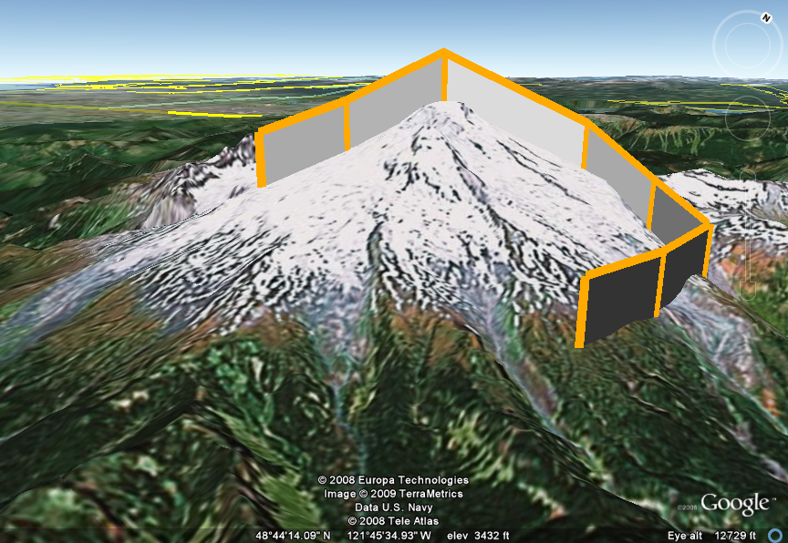

# Fitbit Journey Tracker

The GeoTracker displays informatioon sent through a microcontroller with various sensors to Google Earth. As the microcontroller moves it collects information about the external environment (e.g. GPS, temperature, humidity, UV intensity, etc...) while simultaneously scanning WiFi networks in the area. The data collected is stored in a packet which is transmitted through WiFi via MQTT when a connection is established. The data packet is able to be graphically displayed on a Google Earth map via a KML file.

In the example above the path is dictated by the GPS coordinates collected by the microcontroller as it moves, while the vertical axis is determined by the intensity of the environment variable collected at that specific time. For example, the example image could be displaying the temperature in orange which would be showing very little change during the route.

## Included

Firmware for the microcontroller to collect data from an arduino and send over MQTT, and the software for collecting that data from MQTT and displaying it over google maps. 

## Getting Started

To initiate device, ensure 3xAA batteries are inserted into the holder and the device is powered correctly (a LED light will blink). The module will begin recording measurements from sensors. Measurement time may be up to 20 seconds.

Ensure device is within the Wifi bounds of the network to enable packet transmission. If device is not in Wifi range, the packet will be stored for transmission when device is connected. 

To view the transmitted packet data, open the software executable. [INSERT SOME SOFTWARE STUFF]

### Prerequisites

[THINGS YOU NEED TO INSTALL THE SOFTWARE]

### Installing

Follow the steps below for successful installation of SOFTWARE.exe.

1. Run SOFTWARE.exe
2. If prompted, allow SOFTWARE.exe to make changes to your computer
3. etc etc

Give an example here on how to access some simple data or something

## Viewing the Packets

The data packets can be displayed according to the user's preferences. 

### Packet Display Functions

[DIFFERENT WAYS TO VIEW DATA?]

### Code Styling Tests

The code was styled using the XXXXXXXX Tool:
Link

## Built With

### Firmware:

*   [ESP-IDF Toolchain](https://esp-idf.readthedocs.io/en/latest/# "Title") - Toolchain and IDE for ESP32 Thing Firmware Development
*   [ESP32_weather](https://github.com/Ebiroll/esp32_weather/blob/master/LICENSE "Title") - Library for Si7021-A20 Temperature and Humidity reading
*   [ESP_MQTT](https://github.com/tuanpmt/esp_mqtt "Title") - MQTT Client Library
*   [MMA845X Driver](https://github.com/gschorcht/mma845x-esp-idf "Title") - Accelerometer Driver Library
*   [GPS NMEA](https://github.com/kosma/minmea "Title") - GPS String Parser Library

